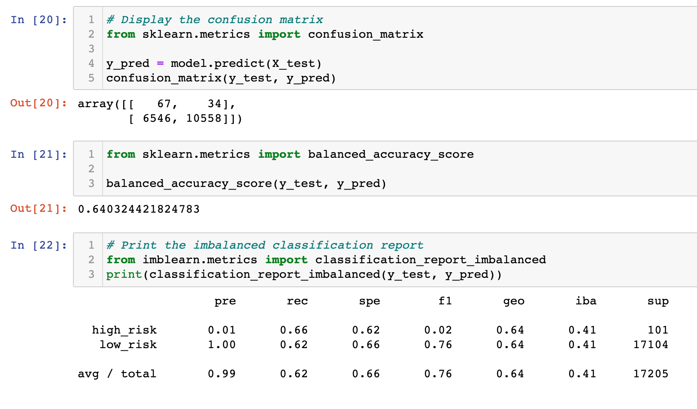

# Credit_Risk_Analysis

## Overview
Provided with data around existing credit loans we utilized various machine learning models to predict loan risks given certain data features.  The data was manipulated or cleaned in order to properly utilize the machine models listed below.

## Results
In this analysis we utilized 6 different machine learning models.  Below is a summary of each model and our key findings

1) Naive Random Oversampling.  In this model we increased the high risk data to have the same quantity as the low risk data. This is done by randomly selecting instances from the the minority class  The results of this model showed:
    * Accuracy score of .64
    * Average Precision score of .99 (.01 for high risk and 1 for low risk)
    * Average recall score of .62 (.66 for high risk and .62 for low risk)

    

2) SMOTE Oversampling.  In this model we again increased the sample size of the low risk data, however with this model the size of the minority dataset is increased with new instances being interpolated.  The results of this model showed:
    * Accuracy score of .65
    * Average precision score of .99 (high risk at .01 and low risk at 1)
    * Average recall score of .69 (high at .61 and low at .69)

    

3) Undersampling ClusterCentroids.  In this model we decreased the majority class to be in line with the minority class.  This is done by identifying clusters of the majority class, then generating synthetic data points called centroids that are representative of the clusters.  The majority class is then decreased using this data down to the minority class size.  The results of this model showed:
    * Accuracy score of .54
    * Average precision score of .99 (high risk at .01 and low risk at 1)
    * Average recall score of .4 (high risk at .69 and low risk at .4)

    

4) SMOTEENN Combination Sampling.  In this model we use a combination of over and under-sampling the data.  The results of this model showed:
    * Accuracy score of .64
    * Average precision score of .99 (high risk at .01 and low risk at 1.0)
    * Average recall score of .57 (high risk at .72 and low risk at .57)

    

5) Balanced Random Forest Classifier.  This model allows us to undersample the majority class while fitting an estimator on top.  The results of this model showed:
    * Accuracy score of .78
    * Average precision score of .99 (high risk at .03 and low risk at 1)
    * Average recall score of .87 (high risk at .7 and low risk at .87)

    

6)  Easy Ensemble Adaboost Classifier.  This model is combination of AdaBoost learners trained on different balanced boostrap samples.  The balancing is achieved by random under-sampling.  The results of this model showed:
    * Accuracy score of .93
    * Average precision score of .99 (high risk at .09 and low risk at 1.0)
    * Average recall score of .94 (high risk at .92 and low risk at .94)

    

## Summary
In this business of providing loans to customers the most important measurement would be the recall score and overall accuracy of the model.  The recall score is important because you want the least amount of high risk loans classified as false negatives (truly high risk but predicted to be low risk).  As such the best model to use in this analysis would be the Easy Ensemble Adaboost Classifier.

